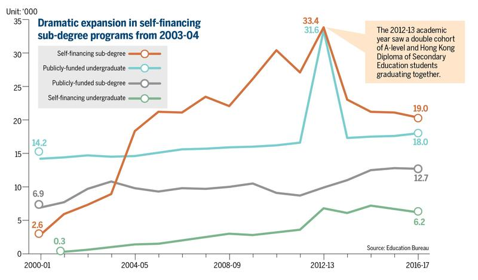
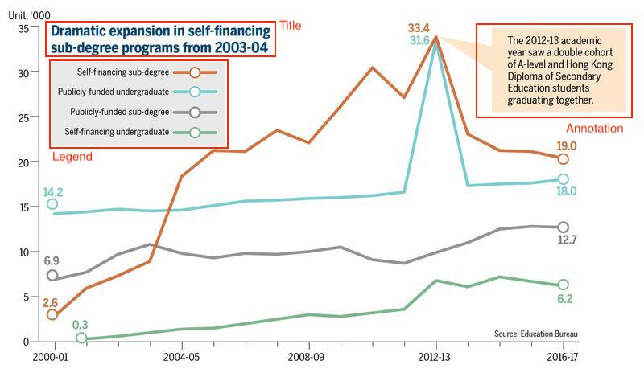
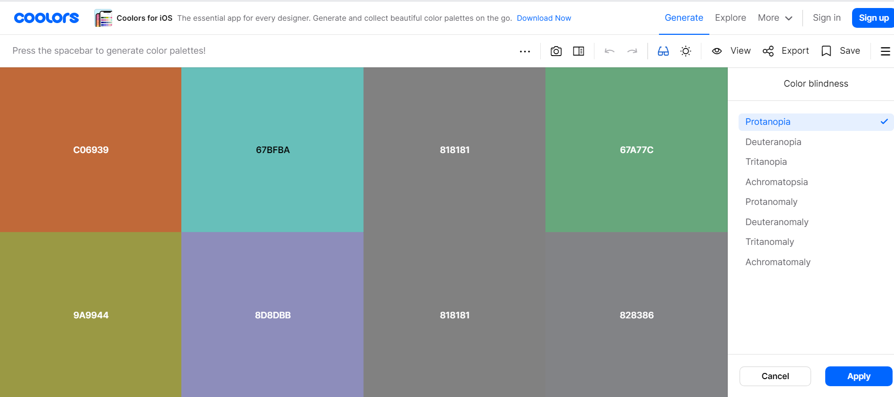
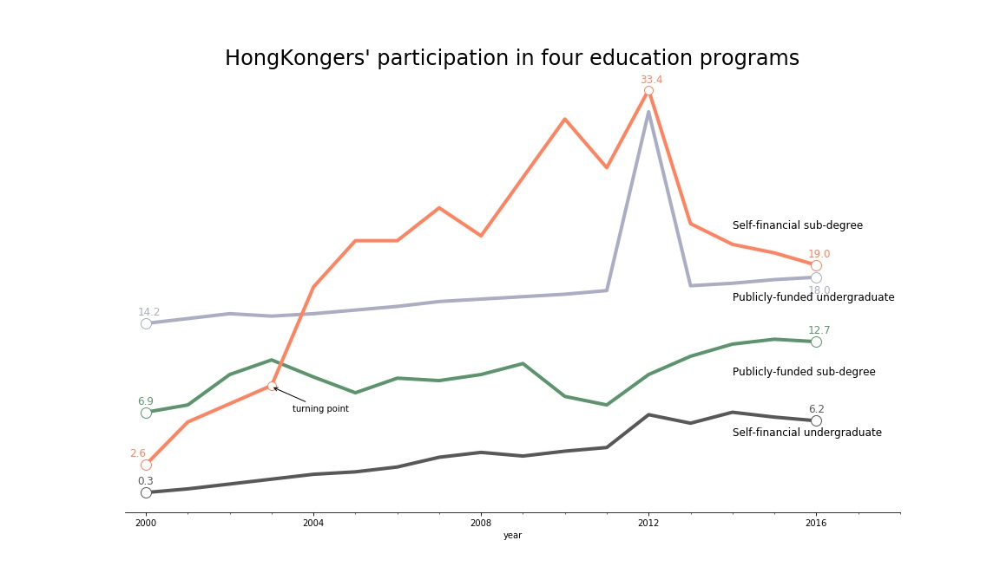
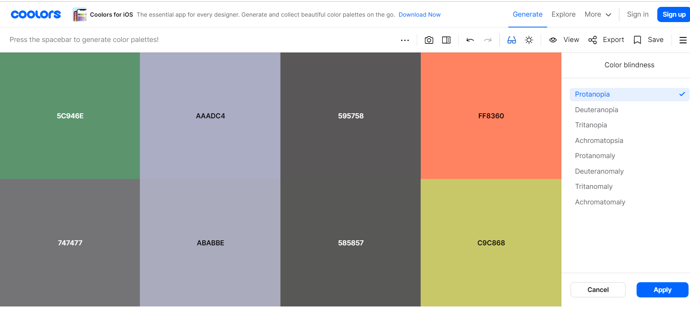

# Report of Project 2

## Group members
**Group 11**
+ Haoran Zhao
+ Jiacheng Shen
+ Zhaoyuan Zhai
+ Yichen Wang

In this project of information visualization, we studied a line chart in a report of China Daily, which was showing the trends of Hong Kong youth's participation in the four education programs from 2000-2017. After studying the background, we deeply analyzed this information visualization in various aspects, such as its impact on society, its advantages and disadvantages as an information visualization, its issues on the aspect of analyzing information visualization and how to improve it into a more readable visualization by combining cognitive theory, etc.  With the efforts of analyzing the background and building the connections between real-world events and the visualization, we introduced the story of this visualization . We fully replicated the original information visualization by using Matplotlib, and then to make improvements, we applied the theory and principles of information visualization on it by using our critical thinking. Finally, we draw our own thoughts on the final visualization. 

The reason we selected this visualization was that the graph has a great impact on Hong Kong society and education. As a graph produced by Hong Kong education bureau, the data in this graph has high accuracy and authority. The theme of graph is to show the rate of Hong Kong youth participated in sub-degree and undergraduate program, from this visualization, we can gain a lot of valuable insights about education state, education reform, and social issues of Hong Kong. Some insights may apply for the same situation in the whole China. 

Acknowledging the importance of the visualization, you may want to know how to read the graph. Actually, the graph is a concise and readable line chart. The x-axis represents the year(from 2000-2017) and the y-axis represents the number of students graduated from certain education program(in thousand). The four lines colored in red, blue, gray and green represent self-financing sub-degree, publicly-funded undergraduate, publicly-funded sub-degree and self-financing undergraduate respectively, showing how Hong Kong youth participation in four different education programs changes in the given period of time. And Each coordinate point represents the number of Hong Kong youth graduated in a certain education program in the year. The graph also gives the value of starting and ending points for each lines, along with the value of key points. 

Except the accuracy, authority and conciseness we have discussed before, there are some other advantages. Instead of using four subplots, putting four colored lines in one graph make it easy to compare the trends and values in a certain year. And the graph emphasizes the key points, which allows the readers focusing on key message. With exact values appeared in starting point and ending point, readers can have an intuitive perception of the difference and trend. However, issues of this visualization are obvious. Some improper elements and errors like wrong position of values confuse the readers. The color is not friendly to color-blindness, due to using gray and green at the same time. Moreover, the original idea of visualization is to emphasize the ‘self-financing sub-degree’ line, while failed to highlight this line among the four lines. Finally, the visualization doesn’t have a concise title that briefly summarize the content. The improvements and reasons will be discussed later in this article. On the whole, the visualization convey the information with relatively high effectiveness. 

When looking at this graph, you may have a question: what is sub-degree and what is self-financing sub-degree ? Don’t hurry, the next few paragraphs will explain all the questions in detail.

The emergence of sub-degree is an essential component of Hong Kong education reform in 2000. Conscious of the relatively low tertiary education participation rate in Hong Kong, the Hong Kong Special Administrative Region Government (HKSARG) in 2000 initiated a policy to increase tertiary education participation rate from around 30 percent to 60 percent of the relevant age group (Education and Manpower Bureau 2006). In contrast to the limited educational opportunities in the past, multiple pathways have been offered to secondary school leavers, ranging from publicly funded universities to self-financing institutions with a variety of two-year sub-degree, two year top-up degree and four-year degree programs. The policy goal has been achieved without significant increase in government spending in tertiary education. This seems to be contradicted to the common sense, how could that happened? Well, actually, the goal is achieved largely through the expansion of the self-financing sector, not by government spending. So with the help of policy dividends,the self-financing sub-degree emerges and expand rapidly along with the education policy in 2000.

Another question is: Why some youths will choose sub-degree instead of undergraduate? Who is more likely to participate in sub-degree? The youth in lower social class  prefer the self-financing sub-degree, especially those have the ambition of raising social class through education. These youths usually don't get enough grades to enter better public-funded undergraduate program, but they still want to raise their social class through education or just to find a better job. Self financing sub-degree gives them hope. Therefore, from the line chart, we can see self-financing sub-degree has a dramatic expansion in 2000-2013, exactly due to the education reform and the needs of youth social mobility. We can infer that the root cause of youth's participation in self-financing education is to raise social class.

Nevertheless, the youth's participation of self-financing sub-degree started to shrink from 2007. People start to recognize drawbacks of self-financing sub-degree due to the lag effect of policy. There are two reasons for decreasing, academic degree saturation and poor quality of self-financing sub-degree. Academic degree saturation means when the total number of opportunities for youth's social mobility remains unchanged, the supply of young people with academic degrees exceeds the demand for the society, causing the loss of the initial competitiveness of young people with degree certificates. Based on this situation, youth's enthusiasm for participating in the education program has decreased, especially for self-financing sub-degree. Besides, media reports often alleged that the quality of self-financed sub-degree programs is poor, and that the prospect for graduates from these programs is bleak, in terms of both further studies and employment. So the negative report of self-financed sub-degree may greatly affect young people's choices on education programs.

The increasing number of four education program, especially the increasing number of self-financing sub-degree, can be seen as Hong Kong youth’s educational participation. Except for self-financing sub-degree, there was also a dramatic increasing number of publicly-funded undergraduate program, indicating a wave of graduation from 2012-2013 and a wave of applying for the publicly-funded education program in around 2008. We can infer that there are something happened in 2008, stimulating a large number of students to join the program, such as a favorable policy towards publicly-funded undergraduate or the change of youth's need. And the real-world case also confirmed the conjecture. An scholarship institution, named HKSAR Government Scholarship Fund, established in 2008. It provides scholarships to outstanding local and non-local students, aiming at attracting outstanding students to join the publicly-funded programs. The time established this institution is exactly the time for wave of applying for the publicly-funded education program.

However, not surprisingly, the increasing trend of participation in publicly-funded undergraduate only remain the one year, after that, the number returned back to the origin level and stayed stable. It could be inferred that this Hong Kong youth's generation meet a peak at the rate of participation in education programs . From the data shown in graph, the number of graduates of self-financing sub-degree and publicly-funded undergraduate peaking at 33.4(thousand of people) and 31.6 in 2012 respectively. Adding up the two numbers, the total number is about 60,000 graduates, which is a large amount to a district with population of 7 million. 

The number of other two programs “self-financing undergraduate” and “publicly-funded sub-degree” stayed slow but stable increasing trend over the period. The overall trend of the four lines is increasing.

Here is a copy of our information visualization from the original website, you can easily find two basic errors here: a) the starting point of the blue line is not on its line; b) the critical value of 31.6 is not placed in right location on the plot.
The other questions about the visualization are:
1. The title is not a suitable summary of the plot.
2. The legend and the annotation attract more attention from the readers than they should. In other words, readers are difficult to catch the main point of the plot.
3. The color is not friendly to the color blindness.

4. The name of x ticks is confusing, and the unit of x-axis is missing.

So, we modify the plot like this:

1. Firstly, we delete the legend and move it to the tail of the lines to attract less attention
2. We also delete the annotation as we thought it is unnecessary and confusing for readers to comprehend the information in graph.
3. We change the title to make it a better summary and replace it on the top of the plot.
4. We delete the y ticks and left border of the plot because we think the y tick is unnecessary and we want to increase the ratio of data presented on graph.
5. According to the original title, we also marked the turning point and the highest point of the line to emphasize the “dramatic changes” of the “Self-financing sub-degree”.
6. We change the color of the four lines to emphasize the orange line as it is the brightest one and to adjust colors friendly to color blindness.

From the analysis of graph and real-world case, our final thoughts about the visualization are: 
1. To a certain extent, the upward-trend of the lines reflects that Hong Kong youth are paying more attention to education, and the root cause of the phenomenon is to raise social class and improve youth social mobility. 
2. Education is still one of the best choices to break through social class and live a better life for young people who have a need for youth social mobility. 
3. Policy is one of the best engines to stimulate the growth of education. 
4. The appearance of policy’s drawback has a hysteresis.
5. When the supply of academic degrees exceeds the demand of the society, and the educated lose their competitiveness, people would pay less attention to education. 

In this article, we selected the visualization related to Hong Kong education programs. We introduced what this visualization is about and how to read it. Combining the real-world case and our critical thinking, we analyzed its impact on society and education. Based on background events, we found the relationship and connections between real case and the graph's changes in trend. We also make proper improvements to correct the errors and remove unnecessary elements, making the visualization more understandable for readers. 
Through this project, we also call on that people should make imporvements when they are working on information visualization, so that to make visualizations better. 
1. Remove the unnecessary elements when making visualization, such as legends. 
2. Choose a conclusive title for your visualization, which should tell key messages of the graph.
3. Use the color-blindness friendly palettes.
4. Emphasize the essential part (line, turning points, keypoints) in your visualization